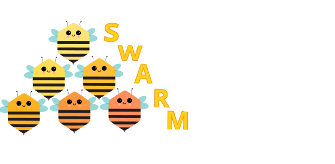
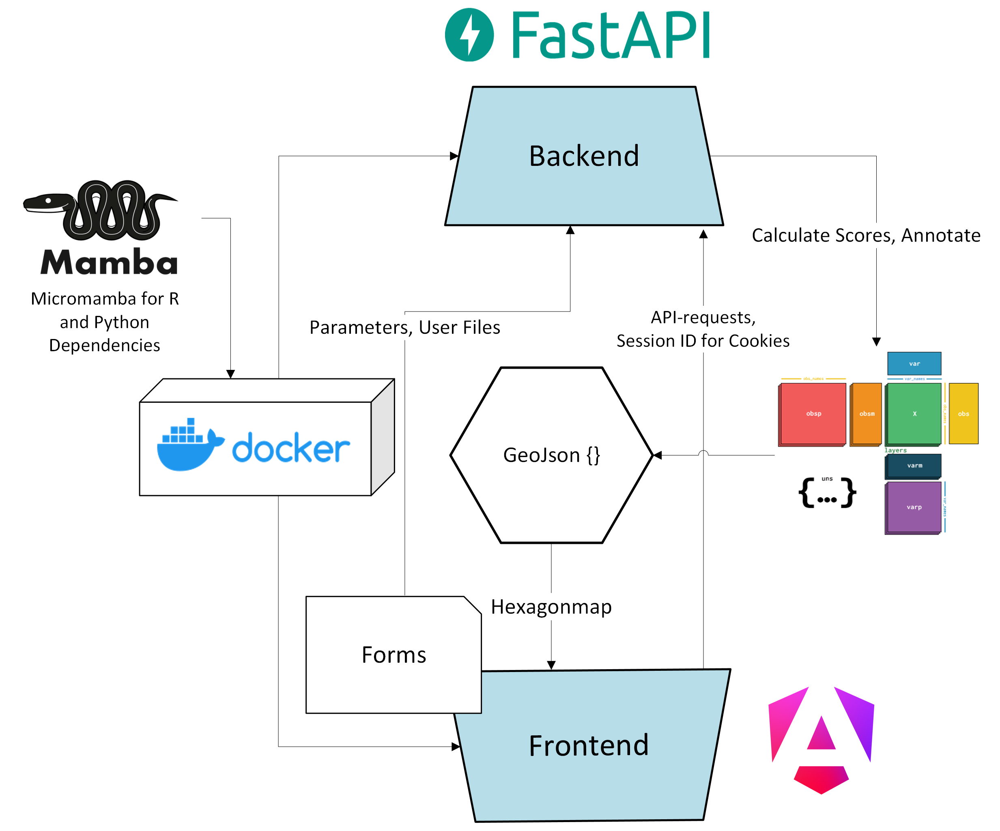

# SWARM

This is the Github-Repository of the MoPiTas Project in the Master Practical course of DaisyBioLab 2025.

## Dataset-Table

https://docs.google.com/spreadsheets/d/1RH_lB4OEUEgZMIYu59_RTwcPmkC-ciyApEnlhvPSJ7E/edit?usp=sharing 

## Overview



## Before Starting SWARM
### Example Data
Use the download_example_data.sh Script to autimatically download and move the example data to the right places.

## Backend

Start the backend development server:

```sh
python backend/main.py
```

## Frontend

Start the frontend development server:

```sh
cd frontend
npm start
```
OR use
```sh
bash launch.sh
```
## Format Requirements
### Visium

The web-tool is working with the anndata-format. This is a tutorial on how counts and scores should be saved.

- **Counts**
  - Stored in `anndata.X`
- **Observations (per Spot)**
  - Stored in `anndata.obs` (all observation columns will be shown, so make sure to clean your anndata before upload). 
- **Clustering**
  - Save the Leiden clustering for Leiden-based scores in `anndata.obs["leiden"]`
- **Gene-wise scores**
  - Moran's I: stored in `anndata.uns["moranI"]` as DataFrame with columns:
    - `I`
    - `pval_norm`
    - `var_norm`
    - `pval_norm_fdr_bh`
  - Geary's C: stored in `anndata.uns["gearyC"]` as DataFrame
    - `C`
    - `pval_norm`
    - `var_norm`
    - `pval_norm_fdr_bh`
- **Leiden cluster scores**
  - Leiden centrality: stored in `anndata.uns["leiden_centrality_scores"]` as DataFrame with columns: 
    - `degree_centrality`
    - `average_clustering`
    - `closeness_centrality`
  - Leiden co-occurrence: stored in `anndata.uns["leiden_co_occurrence"]` as dictionary with entries:
    - `intervals`: interval boundaries, array of shape `(n_intervals - 1,)`
    - `occ`: 3D array of shape `(n_clusters, n_clusters, n_intervals)` (Make sure to select the right num_intervals in Upload form)
  - Leiden neighborhood enrichment: stored in `anndata.uns["leiden_nhood_enrichment"]` as dictionary with entries:
    - `counts`: array of shape `(n_clust, n_clust)`
    - `zscore`: array of shape `(n_clust, nclust)`
- **Regulon scores**
  - Gene sets: stored in `anndata.uns["genie_genesets"]` and `anndata.uns["sponge_genesets"]` as dictionaries with format:
    - `regulator`: `[gene1, gene2, ..., geneN]`
  - AUCell: stored in `anndata.obsm["aucell_scores_{sponge|genie3}"]` as DataFrames with regulators as columns.
  - GSVA: stored in `anndata.obsm["spongeffects_GSVA_scores_{sponge|genie3}"]` as DataFrames with regulators as columns.
  - ssGSEA: stored in `anndata.obsm["spongeffects_ssGSEA_scores_{sponge|genie3}"]` as DataFrames with regulators as columns.
  - Viper: stored in `anndata.obsm["viper_scores_genie3"]` as DataFrame with regulators as columns.
- **Tangram**
  - Cell type compositions: stored in `anndata.obsm["tangram_ct_pred"]` as DataFrame with cell types as columns.
- **LIANA+ scores**
  - Ligand receptor relationships:
    - Cosine similarity: stored in `anndata.obsm["ligand_receptor_cosine_similarity"]` as array of shape (n_spots, n_interactions)
    - P-value: stored in `anndata.obsm["ligand_receptor_p_value"]` as array of shape (n_spots, n_interactions)
    - Category: stored in `anndata.obsm["ligand_receptor_category"]` as array of shape (n_spots, n_interactions)
    - NMF factors: stored in `anndata.obsm["ligand_receptor_NMF_factors"]` as DataFrame with factors as columns.
    - Global scores: stored in `anndata.uns["ligand_receptor_global_scores"]` as DataFrame with columns:
      - `cosine_similarity_mean`
      - `cosine_similarity_std`
      - `ligand_receptor_morans`: Moran's R score
    - Interaction names: stored in `anndata.uns["liana_columns"]["ligand_receptor"]` as array of shape (n_interactions,)
  - Cell type composition - TF activity similarity:
    - Cosine similarity: stored in `anndata.obsm["cell_comp_tf_activity_cosine_similarity"]` as array of shape (n_spots, n_interactions)
    - Category: stored in `anndata.obsm["cell_comp_tf_activity_category"]` as array of shape (n_spots, n_interactions)
    - Global scores: stored in `anndata.uns["cell_comp_tf_activity_global_scores"]` as DataFrame with columns:
      - `cosine_similarity_mean`
      - `cosine_similarity_std`
    - Interaction names: stored in `anndata.uns["liana_columns"]["cell_comp_tf_activity"]` as array of shape (n_interactions,)
  - TF activity:
    - ULM score: stored in `adata.obsm["tf_activity_score_ulm"]` as DataFrame with TFs as columns.
    - ULM p-adjusted value: stored in `adata.obsm["tf_activity_padj_ulm"]` as DataFrame with TFs as columns.
  - Pathway activity:
    - MLM score: stored in `adata.obsm["pathway_activity_score_mlm"]` as DataFrame with pathways as columns.
    - MLM p-adjusted value: stored in `adata.obsm["pathway_activity_padj_mlm"]` as DataFrame with pathways as columns.

We furthermore use GRNs computed using sponge and genie3, both CSV-formatted.

Genie:

```csv
regulatoryGene,targetGene,weight
FOXM1,KIF20A,0.06364686682258
```

Sponge:

```csv
geneA,geneB,df,cor,pcor,mscor,p.val,p.adj
ENSG00000182141,ENSG00000258630,1,0.121684631317227,0.0764637550413806,0.0452208762758468,0.029426,0.519790968019617
```

### Xenium-specific
### Multiom-specific

